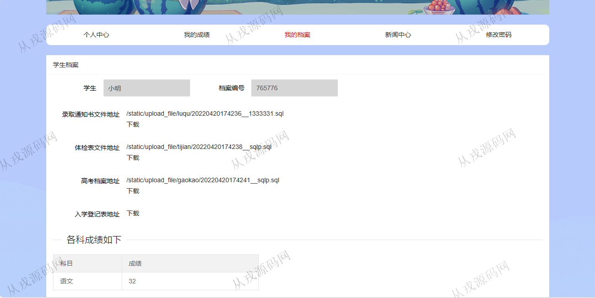
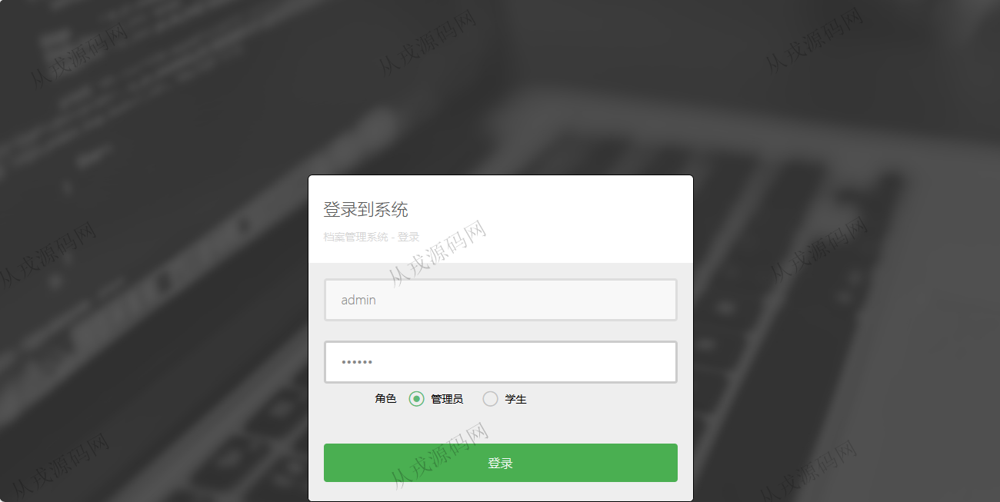
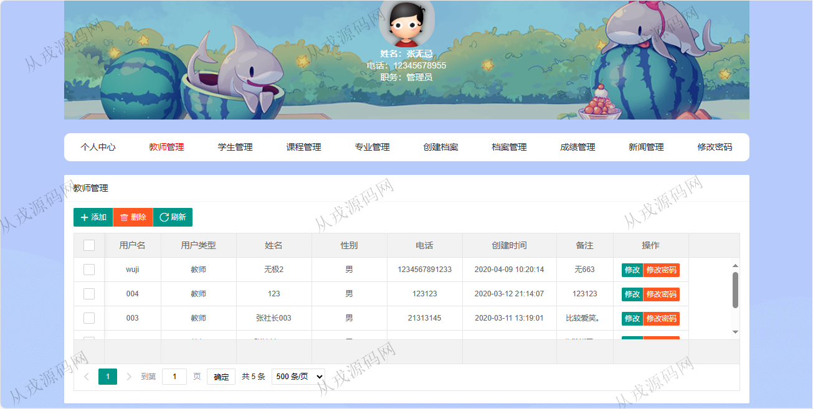
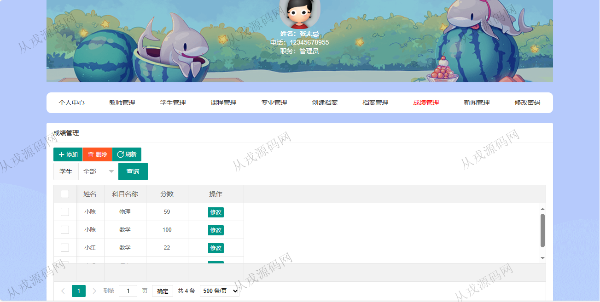
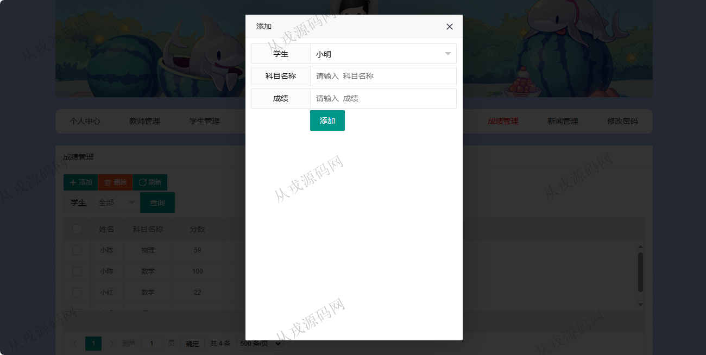
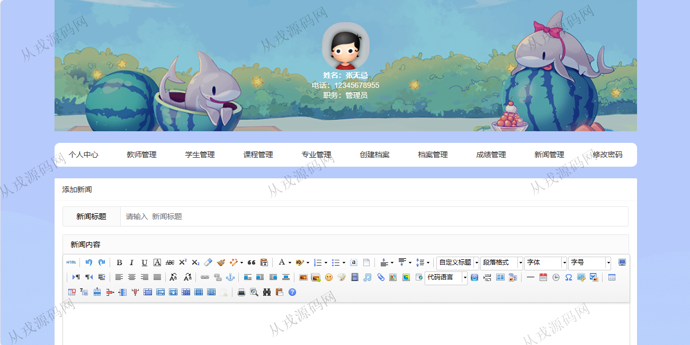

<h1 align="center">120.档案管理系统</h1>

 获取sql文件 QQ: 386869957 QQ群: 377586148 

 [推荐站点: 从戎源码网](https://armycodes.com/) 

## 简介

> 本代码来源于网络,仅供学习参考使用!
>
> 提供1.远程部署/2.修改代码/3.设计文档指导/4.框架代码讲解等服务
> 
> 登录地址：http://localhost:8080/login
> 
> 学生：student 123456
> 
> 管理员：admin  123456
> 

## 项目介绍
基于springboot的档案管理系统：前端 html、jquery、layui，后端 maven、springmvc、spring、hibernate，角色分为管理员、学生；集成教师管理、学生管理、课程管理、档案管理等功能于一体的系统。

## 功能介绍

### 管理员

- 个人中心：个人信息查看与修改
- 教师管理：教师信息的增删改查，密码修改
- 学生管理：学生信息的增删改查，密码修改
- 课程管理：课程的增删改查
- 专业管理：专业信息的增删改查
- 档案管理：档案的增删改查，档案编号，录取通知书，体检表，高考档案，入学登记表，文件上传
- 成绩管理：成绩信息的增删改查
- 新闻管理：新闻信息的增删改查，新闻内容支持富文本编辑

### 学生

- 个人中心：个人信息查看与修改，密码修改
- 我的成绩：本人成绩信息列表查询
- 我的档案：本人档案信息查看，文件下载
- 新闻中心：新闻信息的查看

## 环境

- <b>IntelliJ IDEA 2021.3</b>

- <b>Mysql 5.7.26</b>

- <b>JDK 1.8</b>

## 运行截图

